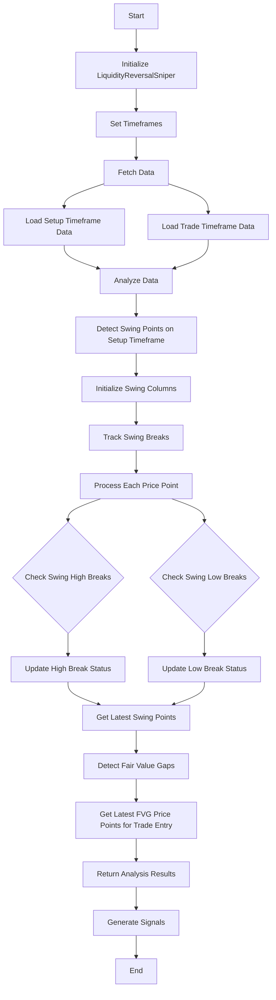

# Liquidity Reversal Sniper Trading Strategy Flow

```mermaid
flowchart TB
    A[Start] --> B[Initialize LiquidityReversalSniper]
    B --> C[Set Timeframes]
    C --> D[Fetch Data]
    D --> E[Load Setup Timeframe Data]
    D --> F[Load Trade Timeframe Data]

    E --> G[Analyze Data]
    F --> G

    G --> H[Detect Swing Points on Setup Timeframe]
    H --> I[Initialize Swing Columns]
    I --> J[Track Swing Breaks]

    J --> K[Process Each Price Point]
    K --> L{Check Swing High Breaks}
    K --> M{Check Swing Low Breaks}

    L --> N[Update High Break Status]
    M --> O[Update Low Break Status]

    N --> P[Get Latest Swing Points]
    O --> P

    P --> Q[Detect Fair Value Gaps]
    Q --> R[Get Latest FVG Price Points for Trade Entry]

    R --> S[Return Analysis Results]
    S --> T[Generate Signals]
    T --> U[End]
```
